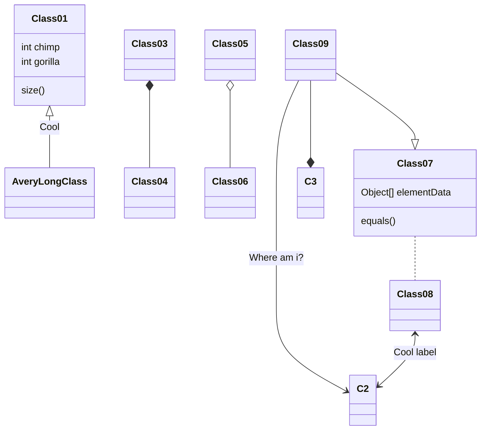

# Test
{: .no_toc }

## Table of contents
{: .no_toc .text-delta }

1. TOC
{:toc}

---

## Hello, my friend

Here is some tests:

```python
print("Hello, my friend.")
```

---

## End

Just waiting for good things to happen won't change anything, Cause I'm the one who can make changes, who make differences.




---
